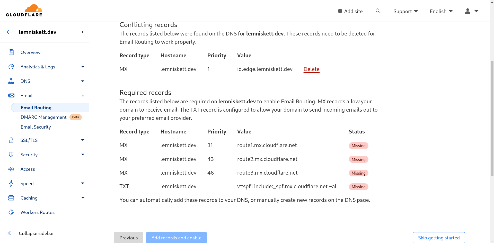
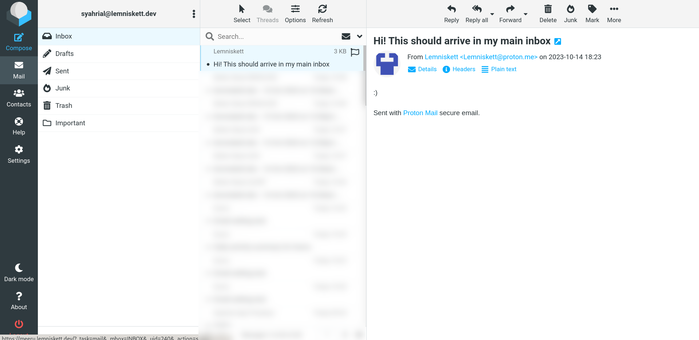

## Introduction

Most of self-hosters (or at least myself) couldn't care less about the uptime of their own services since they're the only user of the service, and maybe some of their family members or close friends.

For many of us, the primary goal of self-hosting is to have complete control over our data and the tools we use, rather than achieving reliability. The joy of tinkering with configurations, customizing every detail, and experimenting with new software without constraints is what encourages me to self-host.

However, this isn't the case for a mail server. For obvious reasons, while my emails are still stored on the server's disk when it's down, being temporarily disconnected from the outside world can be frustrating. What if I miss some booking emails, invoice emails, or any other important emails? I'd be lucky if the platform I'm using alerts me that they can't send their emails (such as LinkedIn), but this isn't the case for every platform, where it doesn't even aware that your mail server is failing and didn't try to resend the emails.

You can configure high availability for your emails by setting up multiple mail servers and MX records, but here, I'm attempting to minimize costs and offload the task to CloudFlare's Email Routing service.

## CloudFlare Email Routing

### Overview

Now, what is Cloudflare Email Routing?

>Cloudflare Email Routing is designed to simplify the way you create and manage email addresses, without needing to keep an eye on additional mailboxes. With Email Routing, you can create any number of custom email addresses to use in situations where you do not want to share your primary email address, such as when you subscribe to a new service or newsletter. Emails are then routed to your preferred email inbox, without you ever having to expose your primary email address.

_- [Cloudflare Email Routing's Overview](https://developers.cloudflare.com/email-routing/)_

How does email routing help in this case? One approach is to set up an email account with another provider, such as Gmail, ProtonMail, or any other preferred email service, and then configure CloudFlare Email Routing to act as a fallback for your domain's email address by forwarding the emails to the email account you have just set up.

**IMPORTANT**: This won't work if you're using subdomains in your email address, e.g. `anon@poste.example.com`, because CloudFlare doesn't support it.

### Setting Up DNS records

Go to CloudFlare Dashboard and select your domain.


Now go to the "Email Routing" section, if you've set up your mail server, CloudFlare will prompt you that the existing MX records will conflict with Email Routing's MX records. You can ignore this by clicking "Skip Getting Started"



Since we're skipping the automatic configuration, we'll need to create the DNS records ourselves, make your your own mail server has the highest priority.


Don't forget to merge Cloudflare's SPF records with your mail server's SPF records otherwise Cloudflare may not be able to forward the emails. For example, if you have the following SPF record:
```
v=spf1 a:mail.example.com ~all
```

You can add Cloudflare's SPF records by including `include:_spf.mx.cloudflare.net` snippet:
```
v=spf1 a:mail.example.com include:_spf.mx.cloudflare.net ~all
```

In my case, it would look like this:


And that's it! It may prompt you that Email Routing is misconfigured, but it's fine as it doesn't expect other MX records to be configured.


### Setting Up Routes

Now we configure the fallback email inbox by adding a destination address in Email Routing > Routes


An email will arrive in your fallback email inbox for verification


Since we want to forward all addresses, configure the fallback email inbox as catch-all address


We're done with the configuration, now it's time to test it!

### Testing the Fallback Email

We have 3 actors in this testing:

- Main recipient (Self-hosted)
- Fallback recipient (Email platform of your choice)
- Sender (The one that will send an email)

Here I'm using ProtonMail as sender and Gmail as fallback recipient. Let's confirm if my main address can receive emails from the sender:




It works as expected, now let's shut down the server that is hosting the mail server:


Now, let's try sending an email to my address and see if the fallback recipient is handling it:


The fallback works!

## Last Words

We have successfully created a fallback mail using CloudFlare Email Routing. As of now, CloudFlare Email Routing seems to be working correctly even if we modified the MX records, who knows if eventually CloudFlare Email Routing no longer works if the MX records aren't enforced.

Also, If you're already familiar with CloudFlare Workers, you may consider to route the emails to a worker instead, and send it to an API that can notify you, e.g. Telegram, Slack, etc. But it's outside the scope of this article `¯\_(ツ)_/¯`.